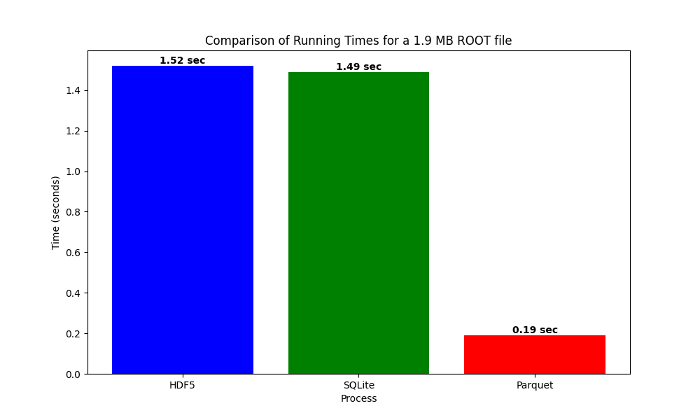
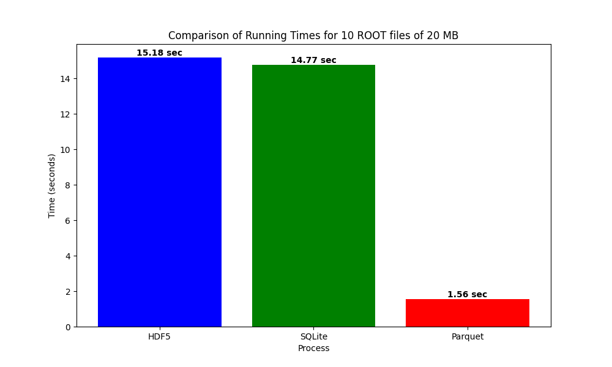
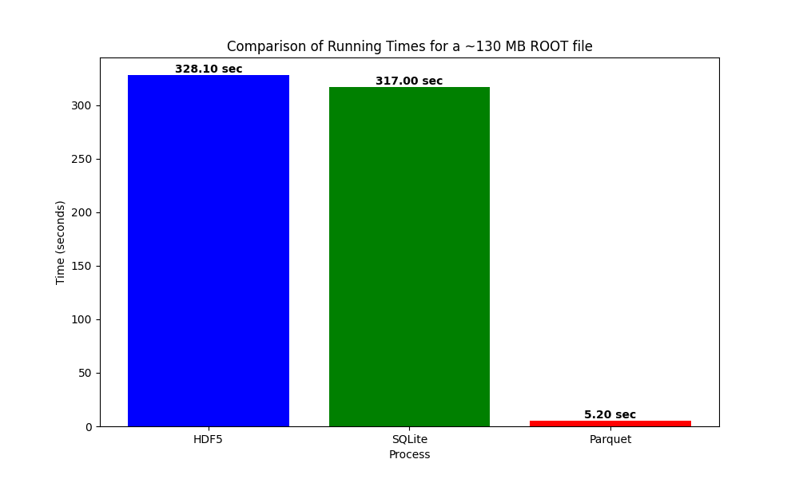

 

[](https://doi.org/10.5281/zenodo.14281076) 

# Convert .root files to other data formats 
#### *from ROOT..  to HDF5/ SQLite/ Parquet*  💻 ⚙️

## Abstract

This repository provides a Python toolset for converting ROOT files to another format. It includes functionalities for reading data from ROOT files branches and saving them as other file formats.

Additionally, we can explore the file structure & print a dataframe. Τhe mutual compatibility and installation of the Python packages used to read and convert .root files ensure minimal dependency conflicts.

**<ins>The scope of this work, was to create a general tool for converting ROOT files to other formats.</ins>**

## Usage

1) _Directory Structure_ - Construct the following directories in your project:
    - data/root: Ensure that you have this directory containing ROOT files.
    - data/h5: Directory where HDF5 files will be saved (if not present it will be created).
    - data/sqlite: Directory where SQLite files will be saved (if not present it will be created).
    - data/parquet: Directory where Parquet files will be saved (if not present it will be created).

    
2) _User Interface_ -  Upon running the script, you'll be prompted to choose one of the following options:
    - Read a HDF5 | SQLite | Parquet file
    - Convert ROOT files to HDF5 | SQLite | Parquet
    - Exit the program.

## Project structure

```
root2data/
│
├── .gitignore
├── LICENCSE
├── README.md
├── create_env.sh
├── main.py
├── requirements.txt
├── data/ # this folder is created if not present
│   ├── h5/
│   ├── parquet/
│   ├── root/
│   └── sqlite/
├── utils/
│   ├── __init__.py 
│   ├── conversion.py
│   ├── data_ops.py
│   ├── file_ops.py
│   ├── hdf5_ops.py
│   ├── parquet_ops.py
│   ├── sqlite_ops.py
│   └── ui_ops.py
└── src/
    └── transform.py

```
## ROOT file structure
##### Our ROOT files have the following simple structure:

```
root_file/
│
├── Tree;1/
│   ├── variable_1.1
│   ├── variable_1.2
│   ├── variable_1.3
│   ...
│   └── variable1_N
│
├── Tree;2
│   ├── variable_2.1
│   ├── variable_2.2
│   ├── variable_2.3
│   ...
│   └── variable_2.N
...
└── Tree;M/
    ├── variable_M.1
    ├── variable_M.2
    ├── variable_M.3
    ...
    └── variable_M.N
```

## Prerequisites

#### _Method 1:_
   
  The following will create a python virtual environment and at the same time activate it:

```
source create_env.sh
```

#### _Method 2:_
  
  Another way is to create the virtual environment manually:
```
python3 -m venv root2data
```
  After that, activate the virtual environment:
```
source root2data/bin/activate
```
  Then execute the following to install required packages:
```
pip install -r requirements.txt
```
Both methods, assure that you have created a virtual env called *root2data*


## Conversion Time Comparisons

### 1 random ROOT file


### 10 ROOT files


### 1 bigger ROOT file



## Communication
Please feel free to contact

<a href="mailto:appinpp.group@gmail.com?"></a>

appinpp.group@gmail.com
## License

This project is licensed under the Apache License. See the [LICENSE](https://github.com/appINPP/root2data/blob/main/LICENSE) for details.

## Contributing
User contributions can be submitted via pull request on GitHub. We recommend that you create your own fork of root2data on GitHub and use it to submit your patches.

